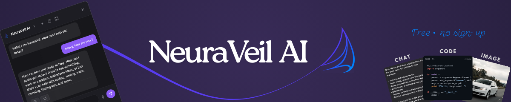

# NeuraVeil Userscript

[NeuraVeil](https://greasyfork.org/en/scripts/560252-neuraveil-ai-chat-in-your-browser) is an AI chat panel, lightweight and modern, that integrates naturally on any webpage.

It uses the open (no-signup) APIs of [Pollinations.ai](https://github.com/pollinations/pollinations) for text and image generation, in order to provide immediate access to an AI directly during your browsing.

No need to change pages.  
No heavy interface.  
No account.

Just a simple, fast, and clean chat, usable on a daily basis.

## What NeuraVeil does

- Adds an AI chat directly on the websites you visit
- Allows managing multiple conversations with history
- Gives control over the depth and style of responses
- Integrates image generation and image search
- Offers real privacy when you don’t want to save anything

Everything works without page reloads.

---

## Main features

### Interface

- Discreet floating chat bubble
- Floating chat icon is draggable (long press + drag), with position saved
- Clicking the chat icon toggles the chat open or closed
- Dynamic chat bubble positioning to stay within the viewport
- Sidebar mode (side panel), movable to the left or right with position saved
- Instant open and close
- Quick close with the Escape key
- A dedicated Data Management section to reset all locally stored settings and conversations

### Conversations

- High number of saved conversations (stored locally in the browser)
- Load, rename, or delete a conversation
- Clear the entire history
- Start a new chat at any time
- It is recommended to regularly remove unused conversations to avoid unnecessary storage usage

### Reasoning and tone

- Persistent reasoning levels:
  Auto, Minimal, Low, Medium, High, Ultra
- Available response styles:
  Default, Professional, Direct, Teaching, Creative, Technical, Geek, Persuasive

  
<strong>How reasoning levels work</strong>

  Reasoning levels control how deeply the AI analyzes a request before responding.

  - <strong>Minimal / Low</strong>: fast, concise answers with minimal analysis  
  - <strong>Medium</strong>: balanced reasoning and clarity  
  - <strong>High</strong>: deeper analysis, structured responses, and may generate images when relevant  
  - <strong>Ultra</strong>: maximum reasoning depth, refined answers, automatic rewriting if the input is unclear, and may generate images when relevant  

  Internal reasoning is never exposed to the user. Only the final response is shown.

  
<strong>Response styles explained</strong>

  Response styles affect tone and presentation, not correctness.

  - <strong>Professional</strong>: formal, structured answers  
  - <strong>Direct</strong>: short replies, no fluff  
  - <strong>Teaching</strong>: step-by-step explanations  
  - <strong>Creative</strong>: vivid language and originality  
  - <strong>Technical</strong>: precise, developer-oriented  
  - <strong>Geek</strong>: tech jargon and references  
  - <strong>Persuasive</strong>: structured and convincing tone

### Ghost Mode (privacy)

- Disables all saving (no conversations are stored)
- Applies a distinct visual theme
- Displays a clear banner when the mode is active
- No data is stored by the script while the mode is enabled
- Image generation in this mode uses Pollinations.ai exclusively with the <code>&amp;private=true</code> parameter

### Images

- Image generation via Pollinations.ai
- Web image search via Openverse, including image source, author, and license information
- Openverse image actions: copy image, download image, and copy image link
- Automatic preloading
- In High and Ultra modes, images may be generated automatically when relevant

### Rendering and usability

- Readable code blocks with syntax highlighting
- Clickable links
- Multiple responses with tabs
- Quick actions: copy, regenerate, download
- Table rendering with dedicated styling and actions
- Rendering mathematical formulas with KaTeX support
- Protection against bugs when switching conversations during a request
- Keyboard input is fully isolated when typing in the chat, preventing website shortcuts from interfering

## Header controls

- Arrow: show or hide additional icons
- Settings: choose the response style
- Ghost icon: enable or disable Ghost Mode
- Info icon (i): open the information panel
- History, new chat, switch to sidebar, close

## Important notes

- NeuraVeil is an AI assistant and may generate inaccurate information. Always verify critical or sensitive information independently.
- Ghost Mode: no data is saved by the script
- Auto and Ultra modes may automatically suggest relevant images
- Uses Pollinations.ai, a free, fast, and performant API
- Uses CSP-safe network requests to remain functional on strict websites (e.g. GitHub)
- On websites with strict Content Security Policies (such as GitHub),
  external Highlight.js theme styles may be blocked by the browser.
  This does not affect core functionality. A fix is currently being worked on.

## Third-Party Libraries

- **Highlight.js**
  - Used for syntax highlighting of code blocks across all supported programming languages.
  - Website: <https://highlightjs.org/>
  - Source code: <https://github.com/highlightjs/highlight.js>
  - License: BSD 3-Clause

- **KaTeX**
  - Used for rendering mathematical formulas with proper LaTeX-style formatting.
  - Website: <https://katex.org/>
  - Source code: <https://github.com/KaTeX/KaTeX>
  - License: MIT

- **Pollinations.ai**  
  - Used as a public, open API for text and image generation.  
  - Website: <https://pollinations.ai/>
  - Source code: <https://github.com/pollinations/pollinations>
  - License: MIT

- **AI Horde (Stable Horde)**  
  - Used as a community-driven image generation backend.  
  - Website: <https://aihorde.net/>
  - Source code: <https://github.com/Haidra-Org/AI-Horde> 
  - License: AGPL-3.0

- **Openverse**
  - Used for searching and retrieving openly licensed web images.
  - Provides attribution, license information, and source links for each image.
  - Website: <https://openverse.org/>
  - Source code: <https://github.com/WordPress/openverse>
  - License: CC0 (API and metadata)

- **GreasyFork SVG Icon**  
  - Used as an interface icon.  
  - Created by denilsonsa.  
  - Source: <https://github.com/denilsonsa/denilsonsa.github.io/blob/master/icons/GreasyFork.svg>
  - License: Not explicitly declared (used with attribution).

---

## Feedback and contributions

Feedback, bug reports, and improvement suggestions are welcome via [GreasyFork feedback](https://greasyfork.org/fr/scripts/560252-neuraveil-ai-chat-in-your-browser/discussions/318048) or [GitHub Issues](https://github.com/DREwX-code/neuraveil/issues).

## Author

Developed and maintained by <strong>Dℝ∃wX</strong> (<strong><a href="https://github.com/DREwX-code">DREwX-code</a>).  
Project designed for simplicity, performance, and user-focused evolution.

## License

This project is licensed under the <strong>Apache License 2.0</strong>.  
You are free to use, modify, and redistribute it under the terms of the license.
